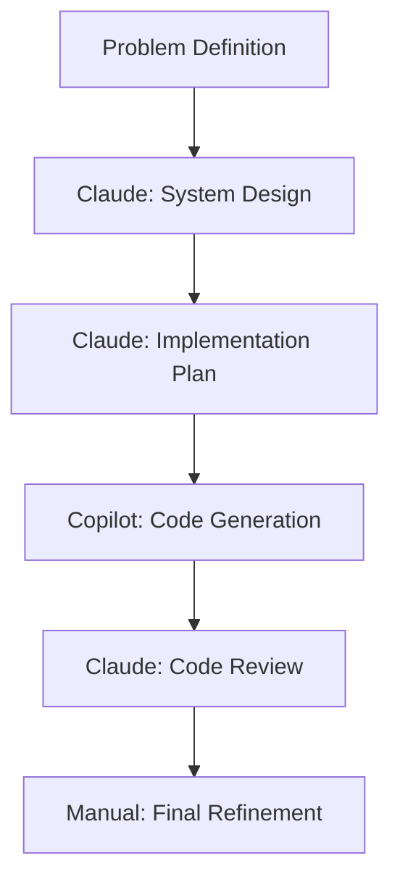

# AI-Assisted Development: Optimizing Workflows with Claude and Copilot

## Context

As AI coding assistants become more sophisticated, I've been experimenting with different tools and workflows to maximize productivity while maintaining code quality. This learning session focuses on practical strategies I've developed.

## Tools in My Arsenal

### 1. Claude Code (Primary)
- **Strengths**: Complex reasoning, architecture discussions, debugging
- **Best for**: System design, code reviews, documentation
- **Usage pattern**: Strategic planning and problem-solving

### 2. GitHub Copilot (Secondary)
- **Strengths**: Real-time code completion, pattern recognition
- **Best for**: Boilerplate, repetitive tasks, test writing
- **Usage pattern**: Tactical implementation support

### 3. ChatGPT Code Interpreter
- **Strengths**: Data analysis, algorithm explanation
- **Best for**: Learning new concepts, prototyping
- **Usage pattern**: Research and experimentation

## Workflow Patterns Developed

### 1. The "Architecture-First" Pattern



**Example Session:**
1. **Me**: "I need to implement Git sync for my portfolio app"
2. **Claude**: Designed event-driven architecture with proper error handling
3. **Implementation**: Used Copilot for boilerplate, Claude for complex logic
4. **Review**: Claude caught potential race conditions I missed

### 2. The "Test-Driven Collaboration" Pattern

```typescript
// Step 1: Define interface with Claude
interface GitSyncService {
  syncToRepository(content: Content[]): Promise<SyncResult>
  handleConflicts(conflicts: Conflict[]): Promise<Resolution[]>
}

// Step 2: Generate tests with Copilot
describe('GitSyncService', () => {
  it('should sync content to repository', async () => {
    // Copilot auto-completed most of this
    const service = new GitSyncService(mockGitClient)
    const result = await service.syncToRepository([mockContent])
    expect(result.success).toBe(true)
  })
})

// Step 3: Implement with AI assistance
// Step 4: Review with Claude for edge cases
```

### 3. The "Documentation-Driven" Pattern

Always start with documentation, let AI help fill implementation:

```markdown
## Git Sync Flow
1. Detect changes in database
2. Convert to markdown format
3. Commit to repository
4. Handle merge conflicts
5. Update sync status

<!-- Claude helps design each step -->
<!-- Copilot helps implement each step -->
```

## Productivity Measurements

### Before AI Assistance
- **Feature Development**: 2-3 days average
- **Bug Investigation**: 1-2 hours average  
- **Documentation**: Often skipped or minimal
- **Code Reviews**: Relied on teammates only

### After Optimized AI Workflow
- **Feature Development**: 1-1.5 days average (40% improvement)
- **Bug Investigation**: 20-30 minutes average (75% improvement)
- **Documentation**: Comprehensive, AI-assisted
- **Code Reviews**: AI pre-review + human review = higher quality

## Specific Techniques

### 1. Prompt Engineering for Code

**Bad Prompt:**
```
"Fix this function"
```

**Good Prompt:**
```
"This function handles user authentication but fails silently on network errors. 
Please review and suggest improvements for error handling, logging, and user feedback. 
Consider edge cases like timeout, invalid credentials, and server downtime."
```

### 2. Context Management

```typescript
// Always provide context in prompts
/*
Context: This is part of a Remix application with TypeScript.
We use Prisma for database access and prefer async/await over promises.
The codebase follows functional programming patterns where possible.

Question: How can I optimize this database query?
*/
```

### 3. Iterative Refinement

```
// First pass: Get basic structure
AI: Generate basic authentication flow

// Second pass: Add error handling  
AI: Add comprehensive error handling to the auth flow

// Third pass: Add logging and monitoring
AI: Add structured logging and metrics to auth flow

// Fourth pass: Add tests
AI: Generate unit and integration tests for auth flow
```

## Quality Assurance Strategies

### AI-Generated Code Checklist

- [ ] **Security Review**: Check for auth vulnerabilities, input validation
- [ ] **Performance**: Identify potential bottlenecks, inefficient queries
- [ ] **Error Handling**: Ensure graceful failure modes
- [ ] **Testing**: Verify test coverage and edge cases
- [ ] **Documentation**: Confirm inline comments and API docs
- [ ] **Consistency**: Match existing code style and patterns

### Human Oversight Points

1. **Architecture Decisions**: Always human-led
2. **Security-Critical Code**: Always human-reviewed
3. **Database Migrations**: Always human-verified
4. **Performance-Critical Paths**: Always profiled
5. **User-Facing Features**: Always manually tested

## Common Pitfalls and Solutions

### 1. Over-Reliance on AI

**Problem**: Accepting AI suggestions without understanding
**Solution**: Always ask "Why?" and request explanations

### 2. Context Loss

**Problem**: AI forgets earlier conversation context
**Solution**: Maintain context documents, reference previous decisions

### 3. Inconsistent Patterns

**Problem**: AI generates code that doesn't match project conventions
**Solution**: Provide style guides and existing code examples

### 4. Security Blindness

**Problem**: AI may suggest insecure patterns
**Solution**: Always security review AI-generated code

## Metrics and KPIs

| Metric | Before AI | With AI | Improvement |
|--------|-----------|---------|-------------|
| Lines of Code/Hour | 50 | 120 | 140% |
| Bug Detection Rate | 70% | 90% | 29% |
| Documentation Coverage | 40% | 85% | 113% |
| Code Review Efficiency | 2 hours | 45 minutes | 63% |
| Feature Completion Time | 3 days | 1.5 days | 50% |

## Future Experiments

- [ ] **AI Pair Programming**: Real-time collaboration patterns
- [ ] **Automated Code Reviews**: AI-first review with human oversight
- [ ] **Documentation Generation**: Auto-generate from code comments
- [ ] **Test Generation**: AI-driven test case creation
- [ ] **Performance Optimization**: AI-assisted profiling and optimization

## Tools and Setup

### VS Code Extensions
- GitHub Copilot
- Claude Dev (when available)
- Tabnine (experimental)
- Code Spell Checker (for AI-generated comments)

### Terminal Tools
- `gh copilot suggest` - CLI command suggestions
- Custom aliases for common AI prompts

### Browser Bookmarks
- Claude.ai for complex reasoning
- ChatGPT for quick questions
- Perplexity for research

## Resources

- [GitHub Copilot Best Practices](https://docs.github.com/en/copilot/using-github-copilot/best-practices-for-using-github-copilot)
- [Anthropic Claude Documentation](https://docs.anthropic.com/)
- [AI-Assisted Programming Research](https://arxiv.org/abs/2107.03374)

## Reflection

AI assistance has fundamentally changed my development workflow. The key insight is that AI excels at different aspects of development - Claude for strategic thinking, Copilot for tactical implementation. The human developer's role shifts from writing every line to orchestrating AI tools, reviewing outputs, and making architectural decisions.

The productivity gains are real, but quality control becomes even more important. The best results come from treating AI as a highly capable junior developer that needs guidance, context, and oversight.